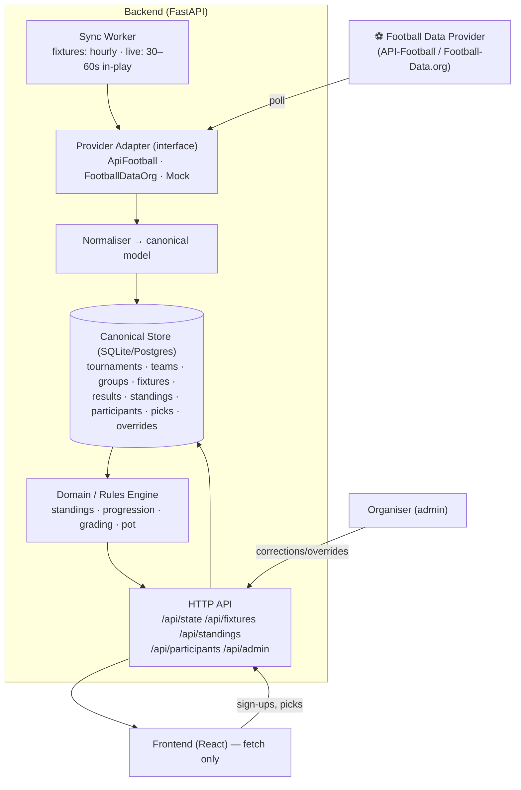
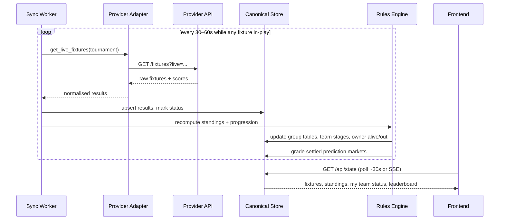
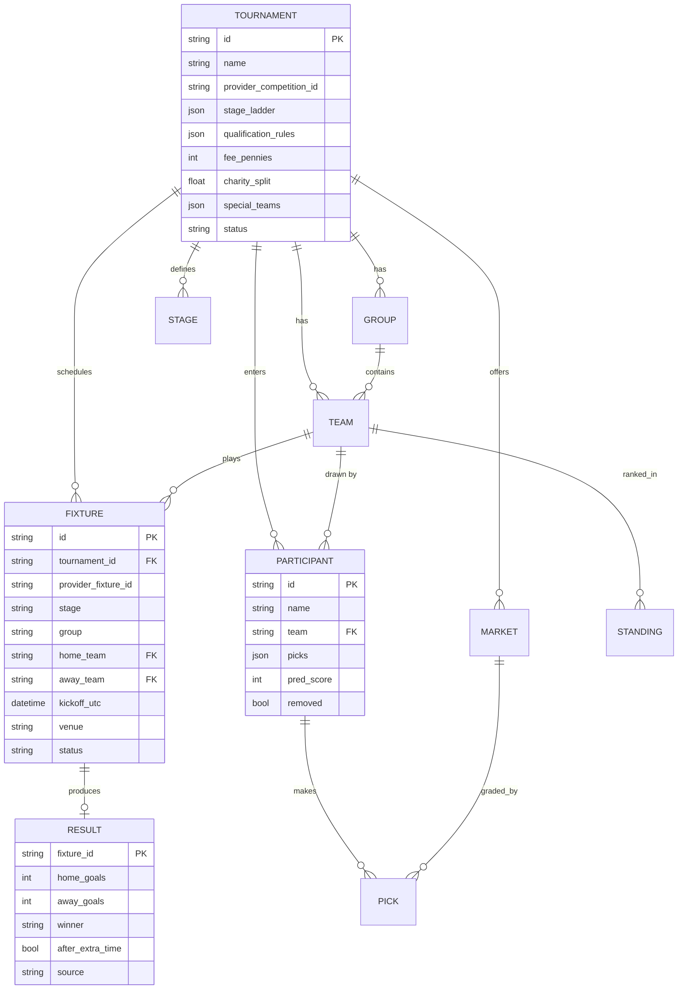
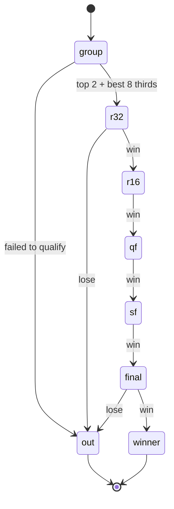

# Wheesht — Data Architecture Audit & Production Plan

> Staff-engineer audit of the Wheesht World Cup Sweepstake codebase, a provider
> recommendation, and a production-ready, tournament-agnostic data architecture.
> **No production code is written yet** — this document is the plan to be approved
> before implementation.

---

## 1. Executive summary

The app is a high-quality **design prototype** that was wired to a thin FastAPI
backend. It works, but it is **not production-ready as a data system** for three
structural reasons:

1. **Two sources of truth for tournament data.** The same teams, fixtures,
   predictions and copy exist *twice* — once in `wc_data.py` (Python/server) and
   once in `static/app/mock-data.js` (JS/client). They will drift.
2. **The tournament is hardcoded.** Teams, the 12-group structure, the 2026
   dates, the round names, the venues, and even individual match scores are baked
   into source. There is no concept of "a tournament" as data — so a second
   tournament (or a real fixture list) means editing code.
3. **No live data path.** Fixtures are synthetically generated (a round-robin
   with invented dates/venues), scores/standings are typed in by hand via an
   admin panel, and "progression" is a manual `alive/out` toggle persisted to
   `localStorage`. Nothing connects to real football results.

The fix is a **single canonical store fed by a swappable football-data provider**,
with **tournament rules expressed as configuration, not code**, and the frontend
reduced to a pure consumer of one API. Recommended provider: **API-Football
(API-Sports)** for the live-score + standings coverage at a hobby-friendly price,
with **Football-Data.org** as the low-cost fallback.

---

## 2. Audit — mock & prototype data inventory

Legend for "Recommended replacement": **[SoT]** = move to the single canonical
store; **[CFG]** = express as tournament configuration; **[API]** = derive from
the live provider; **[DEL]** = delete (prototype-only).

### 2.1 Mock fixtures

| File | Lines | Problem | Recommended replacement |
|---|---|---|---|
| `wc_data.py` | 155–192 | Fixtures **synthesised** by a round-robin loop with invented dates (`start = date(2026,6,11)`), 3 fixed kickoff times, and a recycled venue list. Not the real schedule. | **[API]** Ingest the real fixture list from the provider; **[SoT]** persist to `fixtures` table. |
| `static/app/mock-data.js` | 139–175 | Exact duplicate of the above fixture generator in JS. Guarantees client/server drift. | **[DEL]** Remove; frontend fetches fixtures from the API. |
| `wc_data.py` | 158–163 | Hardcoded `VENUES` list (16 stadiums) used round-robin, unrelated to the actual match. | **[API]** Venue comes with each provider fixture. |

### 2.2 Mock scores

| File | Lines | Problem | Recommended replacement |
|---|---|---|---|
| `static/app/screens-moments.jsx` | 138–150 | Hardcoded result **`Norway 2–1 England`** rendered in the "Result" moment. | **[API]** Pull the relevant fixture's live/final score. |
| `static/app/screens-moments.jsx` | 211, 243–244 | Hardcoded final **`Spain beat France 2–1 after extra time`**. | **[API]** Derive from the final fixture once played. |
| `static/app/screens-hub2.jsx` | 191–193 | Hardcoded scoreboard prose: `Norway 2–1 England`, `Spain 3–0 Morocco`. | **[API]** Render from a recent-results query. |
| `static/app/app.jsx` | 105–106 | Moment menu hardcodes `Norway 2–1 England` and `Spain vs France`. | **[SoT]** Build the replay list from real recorded events. |
| `static/app/screens-admin.jsx` | (Results tab) | Scores **typed in by hand** as the only way state changes. | **[API]** Admin becomes an *override/correction* tool, not the primary input. |

### 2.3 Mock standings

| File | Lines | Problem | Recommended replacement |
|---|---|---|---|
| `static/app/screens-hub.jsx` | 63 | `ProgressRing value={0.6}` + hardcoded `R16` label — a fixed, fake progression. | **[SoT]** Compute from the team's real stage. |
| `static/app/screens-hub.jsx` | 184 | `potShare = Math.round(WC.POT*0.6)` — pot maths assumes an old payout split. | **[CFG]** Use the configured charity/winner split. |
| `static/app/screens-hub2.jsx` | 122 | Hardcoded stats: `8 ties played`, `1 massive upset`, `3–0 biggest hiding`. | **[SoT]** Derive from results aggregates. |
| `static/app/screens-dashboard.jsx` | 15–20, 63 | Stage→label map and `t.rounds / 6` progress divisor hardcode a specific bracket depth. | **[CFG]** Stage list + depth from tournament config. |
| `wc_data.py` | 73–79 | `STAGE_ROUNDS` map (`out-group`→1 … `qf`→4) hardcodes bracket depth. | **[CFG]** Derive from the configured stage ladder. |

### 2.4 Mock users

| File | Lines | Problem | Recommended replacement |
|---|---|---|---|
| `wc_data.py` | 81–117 | `FIRST_NAMES`, `LAST_NAMES`, `FEMALE_NAMES`, `CITIES`, `DEPARTMENTS` — generators for a fake office field. (Currently unused: `people=[]`, but still shipped.) | **[DEL]** Remove from production; keep only behind a Mock provider for demos. |
| `static/app/screens-moments.jsx` | 134–135 | `SEED_REACTIONS` with names `Davie M.`, `Sarah from Sales`, `Big Steve`… | **[DEL]** / **[SoT]** Drive reactions from real participants or remove. |
| `static/app/screens-onboarding.jsx` | 138 | Placeholder `e.g. Davie McAllister`. | Cosmetic — keep as a neutral placeholder. |
| `main.py` | 54–59 | `_merged_people()` merges a "demo field" into real sign-ups. | **[SoT]** Participants table only; no demo merge in production. |

### 2.5 Mock side bets

| File | Lines | Problem | Recommended replacement |
|---|---|---|---|
| `static/app/screens-hub2.jsx` | 84–99 | Hardcoded side-bet markets with **fake live data**: Golden Boot scorers with `4 goals so far`, keepers with `3 clean sheets`, dark horses with odds `12/1`… | **[API]** Top-scorer / clean-sheet markets from provider stats; **[CFG]** odds/markets from config. |
| `wc_data.py` | 199–228 | `predictions` catalogue (winner, golden boot, young player…) hardcodes **2026 player names** (`Mbappé`, `Yamal`, `Endrick`). | **[CFG]** Prediction markets per tournament; **[API]** player option lists from squad data. |
| `static/app/mock-data.js` | 180–199 | Duplicate of the predictions catalogue in JS. | **[DEL]** Single definition server-side. |

### 2.6 Hardcoded dates

| File | Lines | Problem | Recommended replacement |
|---|---|---|---|
| `wc_data.py` | 168 | `start = date(2026, 6, 11)` anchors the whole fixture schedule. | **[API]** Real kickoff datetimes per fixture. |
| `wc_data.py` | 137 | Seeded RNG `Random(20260611)` (date-as-seed). | **[DEL]** Not needed once data is real. |
| `wc_data.py` | 271–273 | `kickoff: 'Thu 11 June'`, `finalDate: 'Sun 19 July'`, `finalVenue: 'MetLife…'`. | **[CFG]** Tournament metadata row. |
| `static/app/mock-data.js` | 152–153 | `START = new Date(2026,5,11)` duplicate anchor. | **[DEL]** |
| `static/app/screens-hub.jsx` | 67 | `YOUR NEXT TIE · TONIGHT 20:00` hardcoded kickoff. | **[SoT]** Real next-fixture datetime. |
| `static/app/app.jsx` | (StatusBar) | Status-bar clock fixed at `20:06`. | Cosmetic chrome — leave or make `Date.now()`. |
| `main.py` | 22 | App title pinned to `…Sweepstake 2026`. | **[CFG]** Title from active tournament. |

### 2.7 Hardcoded tournament logic

| File | Lines | Problem | Recommended replacement |
|---|---|---|---|
| `wc_data.py` | 10–71 | `TEAMS_RAW` — 48 teams, group letters A–L, colours, odds, and a **pre-baked finishing stage** per team. | **[API]** Teams/groups from provider; **[CFG]** group structure. |
| `wc_data.py` | 172–179 | `'ABCDEFGHIJKL'` group iteration + `RR` round-robin pairings hardcode "12 groups of 4". | **[CFG]** Group count/size; **[API]** actual fixtures. |
| `static/app/store.js` | 98–116 | `drawTeam()` assumes 48-team uniqueness rule then sharing. | **[CFG]** Pool size = number of teams in the active tournament. |
| `static/app/store.js` | 119–133 | `predScoreOf()` grading rules embedded in the client. | **[SoT]** Grade server-side from canonical results. |
| `static/app/store.js` | 253–288 | Admin overrides write `alive/stage/rounds` to `localStorage` per-device — **not shared, not authoritative**. | **[SoT]** Server-side overrides table; progression auto-derived. |
| `static/app/screens-dashboard.jsx` | 15–20 | Stage-label ladder (`group`,`r16`,`qf`,`out-r16`…) hardcoded. | **[CFG]** Stage ladder from config. |
| `static/app/screens-onboarding.jsx` | 180–185, 276 | `SCO`/`ENG` special-case takeovers hardcoded into the draw. | **[CFG]** "Special teams" list (e.g. home nations) per tournament. |
| `static/app/screens-moments.jsx` | 70, 90 | Draw animation hardcodes target team `CRO`. | **[SoT]** Use the participant's actual drawn team. |

### 2.8 Temporary / prototype code

| File | Lines | Problem | Recommended replacement |
|---|---|---|---|
| `static/app/mock-data.js` | whole file | Entire client-side mock data layer — a parallel implementation of the backend. | **[DEL]** Replace with a thin `GET /api/state` fetch + a server **Mock provider** for offline demos. |
| `static/standalone.html`, `standalone-offline.html`, `diag.html` | — | Build artefacts / debug pages bundled into the repo. | Move to a `dist/` build step or `.gitignore`; not source. |
| `static/tweaks-panel.jsx` | whole file | Design-tool "edit mode" panel (host postMessage protocol) — prototype tooling. | Keep for internal use, but gate behind an admin/dev flag. |
| `World Cup Sweepstake.zip` | — | The original design export checked into the repo root. | Remove from version control. |
| `support.js` | whole file | 50 KB design-tool support script, unused by the app at runtime. | Verify and remove if unused. |
| `main.py` | 54–59 | `_merged_people()` demo-field merge. | **[DEL]** in production. |

---

## 3. Root-cause themes

1. **Data lives in code.** Tournaments, fixtures, markets and even results are
   source literals. → *Make tournament data, not code.*
2. **Duplication across the stack.** Python and JS each carry a full copy. →
   *One server-side source; the client fetches.*
3. **No ingestion layer.** Nothing pulls real results, so a human is the data
   feed (admin panel). → *Add a provider-backed sync service; admin becomes
   correction-only.*
4. **Derived state is stored, not computed.** `alive/out/stage/rounds` are
   snapshots toggled by hand. → *Compute standings & progression from results.*

---

## 4. Football data provider recommendation

> Pricing below is **indicative** (as of early 2026) and must be confirmed at
> purchase — provider plans change. A single World Cup runs ~4 weeks, so cost is
> effectively a one-month spend.

| Provider | Live scores | Standings | WC 2026 coverage | Ease | Indicative cost | Reliability |
|---|---|---|---|---|---|---|
| **API-Football (API-Sports)** ✅ | ✅ in-play, events, lineups | ✅ auto | ✅ (World Cup league id) | Excellent REST + docs; direct or RapidAPI | Free 100 req/day; paid from ~$19–39/mo | Strong for indie/hobby; high uptime |
| **Football-Data.org** | ⚠️ near-live (delayed on free) | ✅ | ✅ (competition `WC`) | Simplest API; tiny payloads | Free (10 req/min); paid ~£20–50/mo | Good; smaller operation |
| **SportMonks** | ✅ | ✅ | ✅ (plan-dependent) | Good, feature-rich | From ~€39/mo + add-ons | Good |
| **Sportradar / Opta / Stats Perform** | ✅ enterprise-grade | ✅ | ✅ | Heavy onboarding, contracts | $$$$ enterprise | Best-in-class |
| **TheSportsDB** | ⚠️ community | ⚠️ | partial | Easy | Free/cheap | Variable |

### Recommendation

**Primary: API-Football (API-Sports).** It is the best balance of the three
stated criteria for this use case:

- **Reliability** — established, widely used, high uptime; consistent JSON.
- **Cost** — a free tier to build against, and a ~$19–39 paid month covers the
  whole tournament including in-play scores.
- **Ease** — one REST endpoint family (`/fixtures`, `/standings`,
  `/players/topscorers`), great docs, no contract. Maps cleanly onto our
  canonical model.

**Fallback: Football-Data.org** if budget must be £0 and a short score delay is
acceptable — its `competitions/WC` endpoints give fixtures, results and
standings with the simplest possible integration.

The architecture below puts **both behind one adapter interface**, so the choice
is a config switch, not a rewrite. *(If you'd like, I can run a live
price/coverage check before we commit — see the deep-research option.)*

---

## 5. Target architecture

### 5.1 System diagram



### 5.2 Sync sequence (live match day)



### 5.3 Canonical data model



### 5.4 Key abstractions

**Provider Adapter (the swappability seam).**

```python
class ProviderAdapter(Protocol):
    def get_teams(self, comp: str) -> list[CanonicalTeam]: ...
    def get_fixtures(self, comp: str) -> list[CanonicalFixture]: ...
    def get_live_fixtures(self, comp: str) -> list[CanonicalFixture]: ...
    def get_standings(self, comp: str) -> list[CanonicalStanding]: ...
    def get_top_scorers(self, comp: str) -> list[CanonicalPlayerStat]: ...
```

- `ApiFootballAdapter`, `FootballDataOrgAdapter` implement it against their APIs.
- `MockAdapter` replays a recorded JSON snapshot (+ an optional scripted clock to
  simulate a tournament for demos/tests). **This is what replaces `mock-data.js`.**
- Selected by env: `WC_PROVIDER=apifootball|footballdata|mock`.

**Tournament config = data, not code.** A `tournaments/` config (YAML or DB rows)
describes everything tournament-specific:

```yaml
id: world-cup-2026
name: World Cup 2026
provider_competition_id: "1"     # provider's id for the WC
fee_pennies: 500
charity_split: 0.5
special_teams: [SCO, ENG]        # drives the takeover moments
stage_ladder: [group, r32, r16, qf, sf, final, winner]
qualification:
  groups: 12
  group_size: 4
  qualify_per_group: 2
  best_third_qualifiers: 8
```

A **future tournament** = add a config + provider competition id. **Zero code
changes.**

### 5.5 Tournament progression (auto-derived)



A team's `stage`/`alive` and therefore each **owner's status** is *computed* from
results + `qualification_rules`, not toggled by hand. Prediction markets settle
automatically when their deciding result lands (e.g. `winner` when the final is
final; `scotland`/`england` stage markets when that team is eliminated or wins).

---

## 6. Single source of truth — before/after

| Concern | Today | Target |
|---|---|---|
| Teams & groups | `wc_data.py` **and** `mock-data.js` | Provider → `teams`/`groups` tables |
| Fixtures | Synthesised in both files | Provider → `fixtures` table |
| Scores | Hand-typed in admin / hardcoded in JSX | Provider → `results` table |
| Standings | Hardcoded `0.6`, `R16`, prose stats | Computed by Rules Engine |
| Progression / alive-out | `localStorage` admin toggle per device | Computed; shared; server-authoritative |
| Prediction markets | Duplicated catalogue, client grading | Config + server grading |
| Participants | JSON file + demo merge | `participants` table, no demo |
| Fee / charity split | `5` and `0.6`/`0.5` scattered | `tournament` config |

---

## 7. Implementation plan (phased, maintainability-first)

Each phase is independently shippable and leaves the app working.

**Phase 0 — Foundations (no behaviour change)**
- Add `requirements.txt`, `.gitignore` (drop `*.zip`, `dist/`, build artefacts).
- Introduce a DB layer (start with SQLite via SQLModel/SQLAlchemy; Postgres-ready).
- Define canonical Pydantic models + the `ProviderAdapter` Protocol.

**Phase 1 — Single source of truth (kill the duplication) — ✅ DONE**
- `wc_data.py` is now the **one** definition of the tournament scenario.
- `static/app/wc-snapshot.js` is **generated** from it by
  `scripts/build_snapshot.py` (no-op in server mode where `main.py` injects
  `window.WC_DATA`; seeds the same data in the no-server/offline path).
- Deleted the hand-maintained `static/app/mock-data.js` (which had already
  drifted — it still carried the old 4-way payout split vs. the canonical
  winner-takes-all + charity model).
- `preview.html`, `templates/index.html`, and both standalone builds
  (`scripts/build_standalone.py`) now derive from that one source — no drift.
- *Deferred to later phases (need the provider): a DB-backed store and the
  `GET /api/state` fetch replacing the embedded snapshot entirely. The snapshot
  is the Phase-1 stand-in for the `MockAdapter`.*

**Phase 2 — Tournament as config — ✅ DONE**
- All tournament-specific data now lives in `tournaments/world-cup-2026.toml`
  (TOML, read with the stdlib `tomllib` — no new runtime dependency): teams,
  groups, prediction markets, fee, charity split, stage ladder + labels,
  special teams, qualification rules, schedule knobs, venues, and mascot copy.
- `wc_data.py` is now a thin **config loader + assembler** (the dead demo-people
  generators were removed). The active tournament is chosen by `WC_TOURNAMENT`
  (default `world-cup-2026`); a **new tournament is a new `.toml` file, no code
  change**.
- Verified behaviour-preserving: the generated payload is byte-identical to the
  previous output across teams/fixtures/predictions/payouts/fee/lines, plus
  additive config-derived `meta` fields (`stageLadder`, `stageLabels`,
  `specialTeams`, `qualification`) that now flow to the client for later phases.
- Added `requirements.txt`.
- *Still hardcoded in the client (deferred to the Phase 3/4 work that needs live
  data): the `/6` progress divisor, the `0.6` pot maths, and the bespoke
  `SCO/ENG` takeover UX. The config values they should read (`stageLadder`,
  `specialTeams`, `charitySplit`) are now present in the payload.*

**Phase 3 — Live provider integration**
- Implement `ApiFootballAdapter` (+ `FootballDataOrgAdapter` as fallback).
- Build the **Sync Worker**: fixtures hourly; live polling 30–60 s while any
  fixture is in-play; back off otherwise.
- Normalise + upsert into `fixtures`/`results`.

**Phase 4 — Rules engine (automatic standings & progression)**
- Pure, unit-tested functions: `compute_standings(group)`,
  `advance_bracket(results)`, `grade_market(market, results)`,
  `pot(participants, fee, split)`.
- Wire owner `alive/out` and leaderboard to these. Admin panel becomes
  **override/correction only** (audited), not the primary feed.

**Phase 5 — Realtime & polish**
- Server-Sent Events (or short polling) for live score push to the UI.
- Observability: sync health, last-updated timestamps, provider-error alerts.
- Remove dead prototype files (`support.js` if unused, debug HTML, the zip).

**Estimated shape:** Phases 0–2 are the bulk of the maintainability win and carry
low risk (no external dependency). Phases 3–4 add the live feed. Phase 5 is
incremental polish.

---

## 8. Backward compatibility & migration

- The **FastAPI + React structure is preserved** — the dev runs it exactly as
  today; we are swapping the *data source*, not the framework.
- `MockAdapter` keeps the **standalone/offline build working** (it replays a
  recorded snapshot instead of the deleted JS catalogue).
- Existing `data/participants.json` is migrated into the `participants` table by a
  one-off script; the JSON path stays as an export.
- Env flags: `WC_PROVIDER`, `WC_TOURNAMENT`, `WC_LIVE`, `<PROVIDER>_API_KEY`.

## 9. Testing strategy

- **Pure rules** (standings, progression, grading, pot) → exhaustive unit tests
  with fixture scenarios (group ties, best-third edge cases, ET finals).
- **Adapters** → contract tests against recorded provider payloads (golden files).
- **Sync** → integration test driving `MockAdapter` through a scripted tournament
  and asserting owner alive/out + leaderboard at each step.
- **API** → endpoint smoke tests.

## 10. Risks & open decisions

| Risk / decision | Notes |
|---|---|
| **Provider choice & budget** | API-Football (paid month) vs Football-Data.org (free, delayed). Needs your call — drives the API key + cost. |
| **WC 2026 group→knockout rules** | "Best third-placed" tiebreaks are fiddly; encode carefully and test. |
| **Provider id for WC 2026** | Must confirm the exact competition/season id at integration time. |
| **Realtime transport** | SSE vs polling — start with polling, upgrade if needed. |
| **DB choice** | SQLite is fine for an office sweepstake; Postgres if hosted/multi-instance. |
| **Standalone offline build** | Stays on `MockAdapter`; live features are server-only by nature. |

---

### Appendix A — files to delete or relocate in production

- `static/app/mock-data.js` → **delete** (replaced by `MockAdapter` + API).
- `static/standalone.html`, `static/standalone-offline.html`, `static/diag.html`
  → build artefacts; move to `dist/` or remove from source.
- `World Cup Sweepstake.zip` → remove from version control.
- `support.js` → remove if confirmed unused at runtime.
- `wc_data.py` demo-people generators (`FIRST_NAMES` … `DEPARTMENTS`) → move
  behind `MockAdapter` for demos only.
